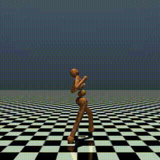

# 🤖 Humanoid Locomotion with PPO

Training a 17-DOF humanoid agent to walk from scratch using 
Proximal Policy Optimization (PPO) — the same RL algorithm 
family used in humanoid robotics research.



## Results (1M Steps)
| Metric | Value |
|--------|-------|
| Final eval reward | 605 |
| Episode length | 122 steps |
| Explained variance | 0.936 |
| Training time | ~5 min (Apple M-series) |
| Total timesteps | 1,000,000 |

## Stack
- Python 3.10, Stable-Baselines3 (PPO)
- MuJoCo 3.x + Gymnasium (Humanoid-v5)
- TensorBoard

## Run It
```bash
conda create -n rl_humanoid python=3.10
conda activate rl_humanoid
pip install gymnasium mujoco stable-baselines3 tensorboard imageio
python train.py
```

## Roadmap
- [x] Humanoid-v5 baseline (PPO, 1M steps)
- [ ] Ant-v5 locomotion  
- [ ] PPO vs SAC comparison
- [ ] Custom energy-efficient reward function
- [ ] Domain randomisation for sim-to-real
